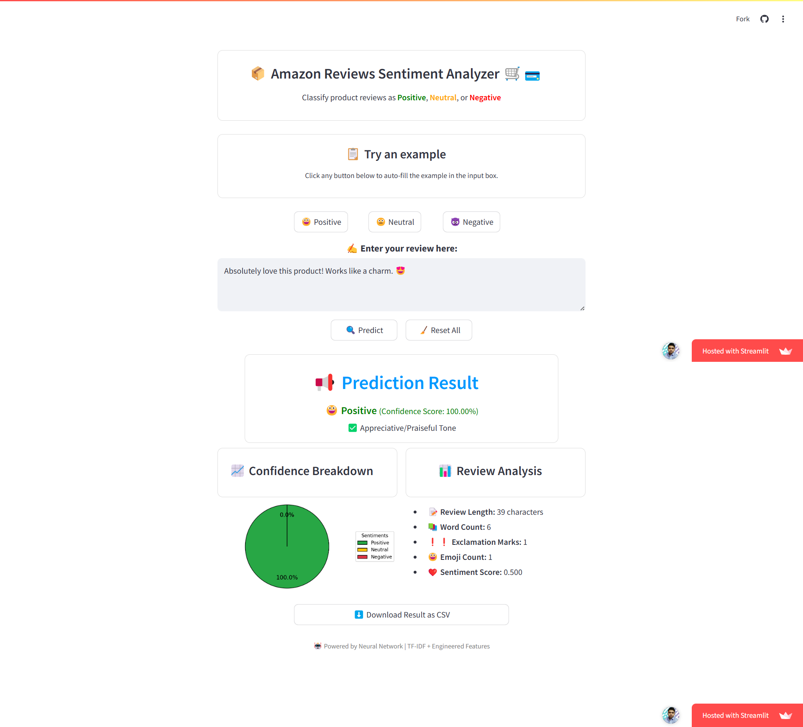
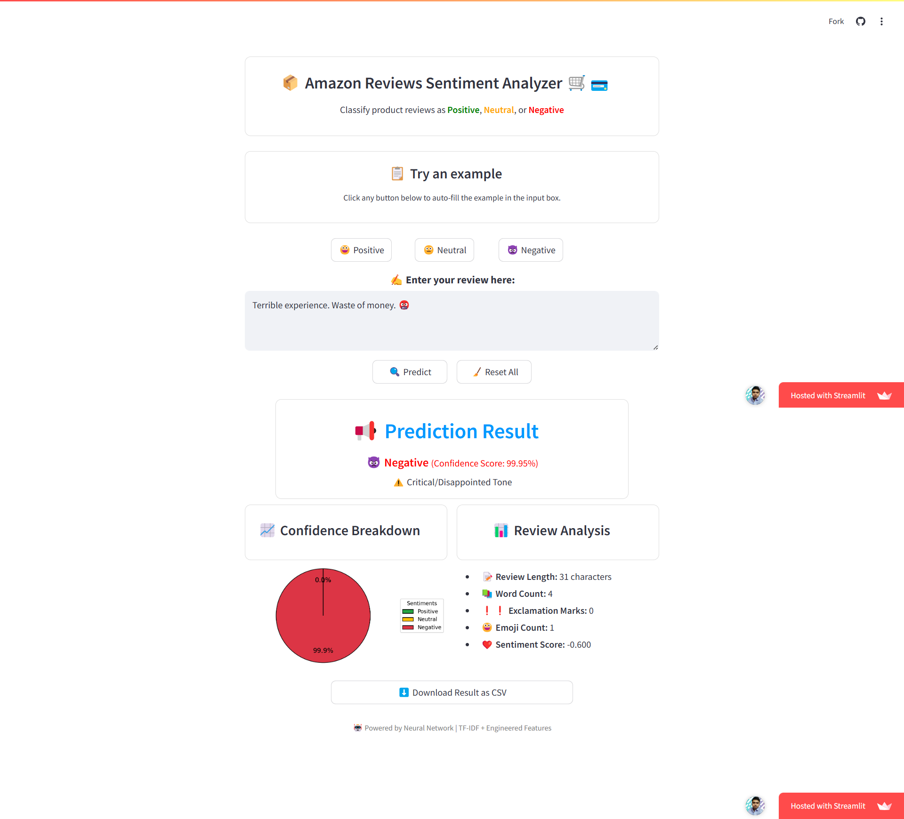

# 📦 Amazon Reviews Sentiment Analysis (NLP Project)

This project focuses on classifying Amazon product reviews into **Positive**, **Neutral**, or **Negative** sentiments using NLP and Machine/Deep Learning. The app is built using **Streamlit** and allows for real-time sentiment prediction with visual feedback.

- 🚀 **Live App**: [Click to Open App](https://debasis-baidya-amazonreviewssentiment-nlp.streamlit.app)
- 📺 **All About My App**: [App Usage Demo](https://youtu.be/8qG7-s3eflk)
---

## 📌 Problem Statement

In today’s e-commerce world, customer reviews hold massive value. But manually reading each one to gauge sentiment is time-consuming. This project aims to automate that by using machine learning to predict the sentiment behind each review.

---

## 🧠 What’s Inside

- Cleaned the review texts (lowercased, removed URLs/digits/punctuation, lemmatized)
- Converted text into **TF-IDF vectors**
- Engineered features like:
  - Review length
  - Word count
  - Exclamation count
  - Emoji count
  - TextBlob sentiment score
- Trained a **Neural Network** classifier with SMOTE for balance
- Built an interactive **Streamlit** app for live predictions

---

## 🖥️ Streamlit App Features

- ✍️ Type or paste any product review and get real-time predictions
- 📋 One-click examples for Positive, Neutral, and Negative cases
- 📈 Pie chart showing sentiment confidence scores
- 📊 Review-level analysis (length, emojis, polarity, etc.)
- ⬇️ Download results as a CSV
- 🤖 Powered by TF-IDF + engineered features + Neural Network

---

## 🔍 How the App Works (Behind the Scenes)

1. **Preprocessing**:
   - Expands contractions, removes noise, normalizes text
   - Lemmatizes and tokenizes using NLTK

2. **Feature Extraction**:
   - TF-IDF vector
   - Extra numerical features
   - Emoji count and polarity score

3. **Prediction**:
   - Neural Network outputs probabilities
   - Includes keyword-based override for detecting neutral sentiments

4. **Visualization**:
   - Interactive pie chart
   - Detailed feature breakdown
   - Exportable results

---

## 📸 App Preview

  
  

> Screenshot of Hosted Streamlit App in action.

---

## 📁 Project Files

- `Amazon_Sentiment_Analysis.ipynb` – Main Jupyter notebook: preprocessing, modeling, evaluation
- `Amazon.py` – Streamlit app to deploy the classifier with an interactive UI
- `neural_network.pkl` – Trained MLPClassifier (Neural Network) model
- `vectorizer.pkl` – Saved TF-IDF vectorizer for consistent inputs
- `label_encoder.pkl` – Encodes/decodes sentiment labels
- `scaler.pkl` – Scaler used for numerical feature normalization
- `requirements.txt` – All required libraries for Streamlit

---

## 🙋‍♂️ About Me

I made this project to turn a  Machine/Deep Learning model into something anyone can actually use. Instead of just running code in a notebook, I wanted to build a working web app where you can paste a review and instantly see what the model thinks.  

It was a fun way to learn how to combine data cleaning, model training, and app building — all in one project.

**– Debasis Baidya**
